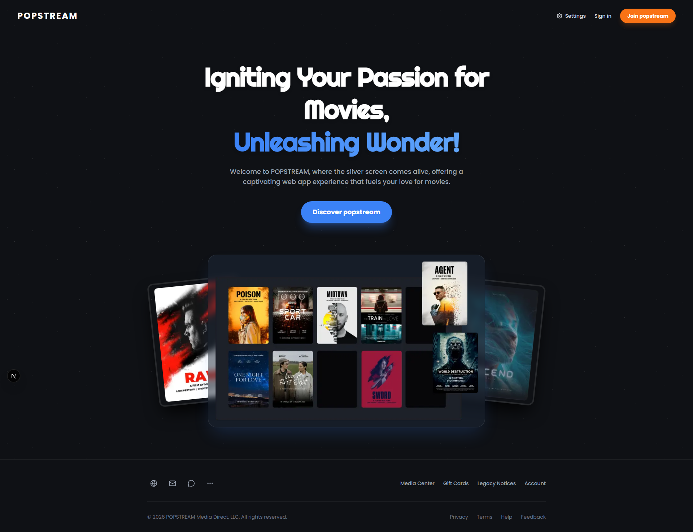

# POPSTREAM

POPSTREAM is a vibrant, modern movie streaming platform built with Next.js 16 (App Router), React, and Tailwind CSS v4.

## Deployment

The project is deployed on Vercel:
[https://popstream-rho.vercel.app](https://popstream-rho.vercel.app)

## UI/UX Pro Max Design System

This application implements the **Vibrant & Block-based** feature-rich showcase pattern:
- **Typography:** Righteous (Headings) and Poppins (Body)
- **Colors:** Deep Dark (#0F1115), Electric Blue (#3B82F6), and Vibrant Orange (#F97316)
- **Features:** Floating responsive layouts, gradient typography, glassmorphism UI elements, and glowing shadow effects.

## Visuals

## Legacy Codebase

The original HTML/CSS template has been preserved in the \popstream-legacy\ branch or \legacy\ folder for historical purposes.
